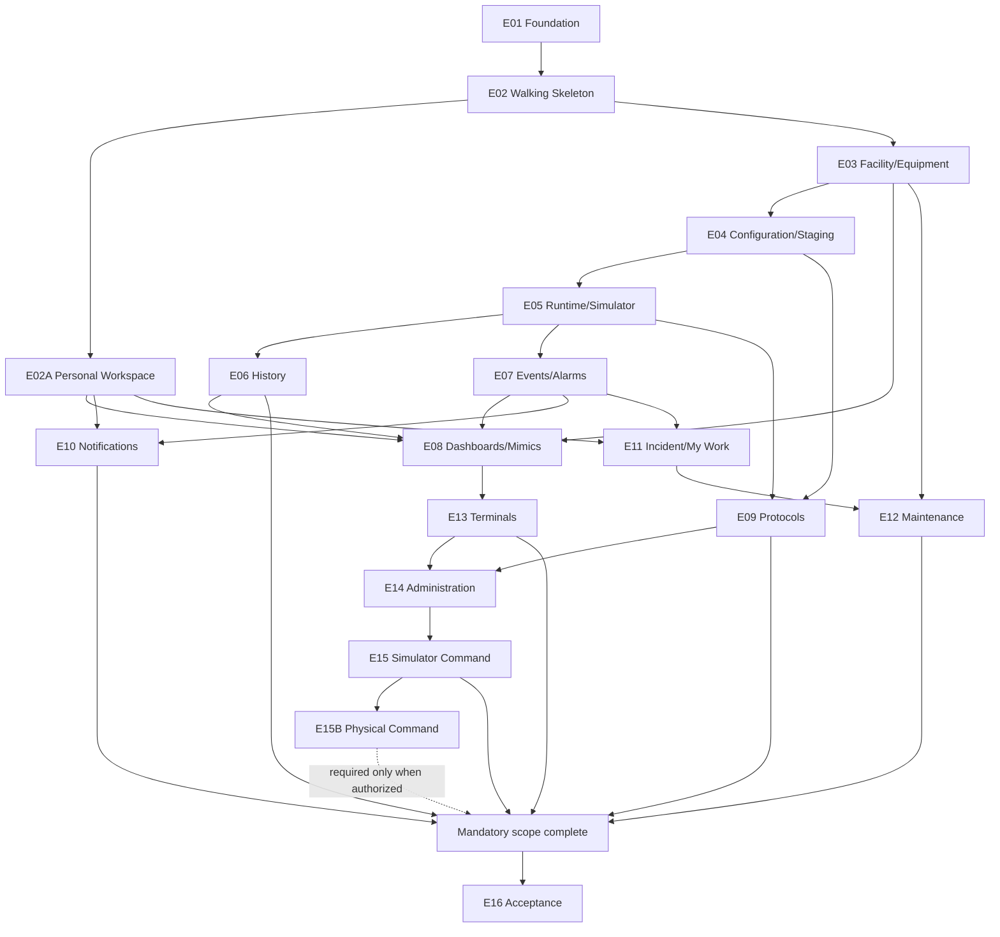

# Dispatcher — дорожная карта технической реализации

**Статус:** нормативная последовательность  
**Дата:** 18 июля 2026 года  
**Основание:** `./DISPATCHER_MASTER_IMPLEMENTATION_SPECIFICATION.md`

## 1. Модель выполнения

Реализация использует C#-first modular-monolith organization с сохранённой logical Core↔Server boundary. Сначала создаётся walking skeleton, затем один предметный контур доводится до `Accepted in dependency envelope` и интегрируется до начала следующего. Общая regression suite выполняется постоянно.

`Sprint` ниже — execution package, а не фиксированный календарный интервал. Детали находятся в `./DISPATCHER_SPRINT_CATALOG.md`.

## 2. Этапы

| Этап | Спринты | Цель | Входные зависимости | Выход и обязательный gate | Stable после этапа | Provisional после этапа |
|---|---|---|---|---|---|---|
| `E00` Baseline alignment | `S00` | Согласовать C#-first и implementation-комплект | Актуальные product/Web/architecture sources | `ADR-001`, настоящий комплект | Язык первой реализации, source priority, sequencing | Storage, transport, process topology |
| `E01` Platform Foundation | `S01–S04` | Создать production-oriented solution, semantic primitives и cross-cutting nucleus | `E00` | Green Windows/Linux build/test; `IG-01` — `IG-04` закрыты до соответствующего implementation внутри этапа | Toolchain, module rules, canonical IDs/value/time/error, migration/session/audit conventions | Capacity limits, production AuthN, service extraction |
| `E02` Walking Skeleton | `S05–S06` | Проверить Simulator→Core→Server→Web read path | `E01`, realtime decision | Один scoped widget со snapshot/delta/gap/resync | Минимальный Core↔Server/Web contract и integration host | Production persistence scale, protocols, Alarm/History |
| `E02A` Personal Workspace | `S06A` | Реализовать Web shell, independent Home workspace, person/profile/search/preferences nucleus | `E02`, session/security nucleus | Канонические маршруты и permission-filtered personal workspace | Person/account split, navigation, assigned Home composition и preference contracts | Полное наполнение Home данными последующих модулей и full external IAM |
| `E03` Facility & Equipment | `S07–S08` | Реализовать локации, Equipment, points и эксплуатационный read path | `E02` | Registry/detail use case, permissions, audit и persistence accepted | Facility/Equipment identities и ownership | Discovery и все protocol forms |
| `E04` Configuration & Staging | `S09–S11` | Реализовать revisions/publication, общий device staging и Simulator activation | `E03` | Draft→validate→publish→activate→restart/rollback | Revision/publication semantics, add-only import, template/secret rules | Production protocol activation |
| `E05` Runtime & Simulator | `S12–S14` | Довести acquisition/current/quality/freshness/recovery на Simulator | `E04` | Golden determinism, protected facts, restart/fault/load evidence | Runtime semantics и Simulator oracle | Real protocol behavior и final process topology |
| `E06` History | `S15–S16` | Добавить independent history acceptance и trends | `E05`, data gate | Ingest/gap/query/aggregation/retention tests | History position/query contract | Separate historian extraction и final capacity limits |
| `E07` Events & Alarms | `S17–S19` | Реализовать local Alarm authority и Event Dispatcher | `E05`; History используется как consumer, не owner | Alarm occurrence lifecycle, immutable Event journal, flood/recovery evidence | Alarm/Event separation и contracts | Full incident/crisis workflow |
| `E08` Dashboards & Mimics | `S20–S22A` | Реализовать dashboard runtime, Dashboard Editor и SVG Mimic Editor поверх реальных consumers | `E02A`, `E03`, `E05–E07` | Published manifest, scoped realtime, SVG safety/publication и core editor workflows | Dashboard/Window/Widget/Mimic contracts | Advanced collaboration и general responsive UX |
| `E09` Protocol Commissioning | `S23–S26` | Ввести process/security boundary, Modbus TCP и SNMP read-only | `E04–E08`; `S23` фиксирует `DG-07` evidence plan | Реальные sources проходят commissioning→runtime→History/Alarm/Web; `S26` закрывает `DG-07` отдельно для двух заявленных read-only profiles | Read-only protocol contracts и diagnostics | Physical writes, additional protocols, Driver SDK |
| `E10` Notifications | `S27–S28` | Реализовать policy, coverage, inbox и delivery | `E02A`, `E07`, identity/session nucleus | Alarm/event→notification→inbox и initial SMTP delivery с retry/audit | Notification ownership и initial provider boundary | Дополнительные каналы и organization-specific escalation SLO |
| `E11` Incident & My Work Nucleus | `S29` | Реализовать только утверждённый incident nucleus и work projection | `E02A`, `E07`, IAM | Source link, coordinator, assignment projection и permissions | Nucleus contracts | Full incident workspace и generic workflow |
| `E12` Maintenance | `S30–S32` | Реализовать independent assets, approved plan/forecast nucleus и подтверждённый work-order lifecycle | `E03`, IAM; связи с `E07/E11` | Asset/forecast/work order/checklist acceptance | Maintenance identity и accepted lifecycle | Full plan CRUD/resource/contractor/mobile scope |
| `E13` Terminals | `S33–S34` | Реализовать device identity, fleet и ограниченный kiosk runtime | `E08`, IAM/realtime, `IG-12` | Enrollment/profile/content/presence; Wallboard deny | Terminal identity и content policy | Hardware attestation и wallboard playlists |
| `E14` Administration | `S35–S36` | Завершить production AuthN, согласованный admin, health, data quality и audit views | Все предыдущие owner modules | Production login/session и permission-safe admin/diagnostics paths | Initial production AuthN, admin/effective settings и operational views | Full external provisioning и enterprise-specific integrations |
| `E15` Command on Simulator | `S37–S38` | Реализовать command security/lifecycle без physical effect | `E04`, `E05`, `E07`, `E14`, `AR-08/DG-05` | Lease→preflight→execute→uncertain/reconcile на Simulator | Command semantic contract | Любой physical write |
| `E15B` Physical Command Qualification | `S39–S40` conditional | Квалифицировать строго ограниченные physical writes в разрешённой test/OT среде | Explicit user authorization, `E15`, `AR-08/DG-05`, applicable protocol-specific `DG-07` и закрытый target/environment pre-production operations evidence slice | Per-protocol safety, audit, fencing, rollback/disable acceptance | Только qualification evidence; production enablement ещё false | Все production writes до `E16` и final explicit enablement; life-safety deny |
| `E16` Operations & Product Acceptance | `S41–S43` | Подтвердить production deployment всего обязательного scope | Все `E01–E15`; `E15B` только если авторизован; входные решения `AR-09` и bounded topology baseline | Linux package, backup/restore, upgrade/rollback, security/recovery/load acceptance; final `AR-10` consolidation и закрытие `DG-08` в `S43`; optional final command enablement | Production baseline и runbook | Provisional product capabilities |

`E15B` не начинается автоматически. Даже успешно пройденная qualification не включает production writes: final enablement возможно только в `S43` после `DG-08` и отдельного подтверждения заявленного scope.

## 3. Зависимости

## 4. Critical path

Нормативная component-first последовательность задаётся таблицей этапов и каталогом спринтов: все `E01–E15` обязательны; `E15B` conditional. Граф показывает technical dependencies, а не разрешение пропускать модуль.

Основной dependency spine: `E00 → E01 → E02 → E03 → E04 → E05 → {E06,E07} → E08 → E09 → E14 → E15 → E16`. Ветви `E02A`, `E10–E13` также обязаны войти в `Mandatory scope complete` до `E16`.

## 5. Integration checkpoints

| ID | После | Обязательное доказательство |
|---|---|---|
| `IC-01` | `E02` | Simulator current проходит Core→Server→Web; snapshot/gap/resync и authorization работают |
| `IC-02` | `E04` | Published revision активируется атомарно, переживает restart и откатывается новой revision |
| `IC-03` | `E06/E07` | Current, History, Event и Alarm восстанавливаются без смешения authority/positions |
| `IC-04` | `E08` | Dashboard получает только разрешённые bindings; reconnect/slow consumer не влияют на другие scopes |
| `IC-05` | `E09` | Modbus/SNMP read-only проходят полный путь; diagnostics не меняет runtime и не раскрывает secrets |
| `IC-06` | `E10–E12` | Alarm→notification/assignment/maintenance links сохраняют независимые owners |
| `IC-07` | `E13–E14` | Kiosk/admin интегрированы без permission leakage и command escalation |
| `IC-08` | `E16` | Linux install/restore/upgrade/recovery/security/load suite пройдены |

## 6. Decision gates

| Gate | Latest point | Решение | Safe default до закрытия |
|---|---|---|---|
| `IG-01` Toolchain | До `S01` | .NET SDK, repository/solution, analyzers, Windows/Linux CI | Один supported .NET SDK, locked in repository; no native toolchain |
| `IG-02` Semantic contracts | До `S05` | IDs, value/unit/quality/time, revisions, errors, positions | No implicit conversion; distinct identities/positions |
| `IG-03` Data/persistence | До persistence части `S03` | Transaction/storage/migrations/backup model по owner classes | PostgreSQL + module-owned schemas/contexts является implementation default; History квалифицируется отдельно; смена требует ADR |
| `IG-04` Session/security nucleus | До внешнего `S06` | User/device session semantics, effective permission, revocation, audit admission | Environment-gated least-privilege test session only; no anonymous/admin bypass |
| `IG-04P` Production AuthN | До production login в `S35` | Initial credential/IdP validation, session issuance/refresh/expiry/revoke и recovery | Secure local Dispatcher account/session is default; external OIDC/provisioning requires separate integration decision |
| `IG-05` Web contracts/realtime | До `S06` | Request/response и Web realtime implementation | ASP.NET Core HTTP contracts + SignalR являются implementation default; semantics имеют приоритет над transport |
| `IG-06` Protocol isolation | До protocol code в `S23` | Process/workload identity, secrets locality, OT network и resource isolation | Отдельный от ASP.NET Server Core/runtime host с Core-controlled adapters внутри; третий protocol-worker process требует `IG-09` |
| `IG-07` Command security | До `S37` | Lease, step-up, revocation, intent/execution, audit, uncertainty | Command unavailable |
| `IG-08` Physical write authorization | До `S39` | User-authorized target/command scope, `AR-08/DG-05`, applicable protocol-specific `DG-07`, закрытый target/environment pre-production operations evidence slice, feedback, fencing и disable | Qualification capability absent; AI не закрывает gate самостоятельно; full `DG-08` остаётся открытым до `S43` |
| `IG-09` Extraction | До любого process/service/native extraction сверх approved runtime isolation | Evidence, owner, contract, migration, rollback и operations | Remain module in current deployable; no empty service |
| `IG-10` Production operations | Bounded baseline до implementation в `S41`; final AR-10 consolidation после evidence `S41` | Linux topology, secrets, packaging, backup/restore, upgrade и support model | No production claim |
| `IG-11` Product maturity | До provisional capability | Product/UX/API contract freeze | Capability remains placeholder; AI не закрывает gate самостоятельно |
| `IG-12` Terminal enrollment | До production identity в `S33` | Trusted credential, challenge lifetime, replay/revoke, storage и recovery | Semantic preview only; no production pairing |
| `IG-13` Notification provider | До provider code в `S28` | Initial production channel, credentials/config, retry/receipt и test environment | SMTP email is implementation default; Web inbox remains independent |

`AR-07/DG-03`, `AR-08/DG-05`, `AR-09/DG-08` и `AR-10` закрываются через соответствующие gates; full `DG-08` закрывается результатом `S43`. Их нельзя обходить тем, что весь initial code написан на C#.

AI-разработчик вправе закрывать technical gates `IG-01–IG-07`, `IG-09`, `IG-10`, `IG-12` и `IG-13` через ADR и требуемые tests/evidence, используя safe default. `IG-08` и `IG-11` требуют решения пользователя о safety/product scope.

Минимальное evidence технического gate:

- выбран один baseline, перечислены alternatives и причина отказа;
- owner/security/failure/recovery последствия определены;
- migration/rollback или безопасный отказ определены;
- contract/platform test подтверждает решение;
- ADR и `IMPLEMENTATION_STATE` обновлены до зависимого implementation.

| Gate | Дополнительное обязательное evidence |
|---|---|
| `IG-01` | Locked toolchain и green Windows/Linux clean build/test |
| `IG-02` | Property/contract tests distinct IDs, values, times, revisions и positions |
| `IG-03` | Migration from empty, rollback/crash point и restore proof по owner classes |
| `IG-04` | Session expiry/revoke, permission denial и audit admission tests |
| `IG-04P` | Production login/issuance/refresh/recovery без test identity |
| `IG-05` | Authorized snapshot/delta/gap/resync и slow-consumer test |
| `IG-06` | OT workload identity, secret non-disclosure, process failure/isolation test |
| `IG-07` | Lease/revoke/stale/timeout race tests при отсутствующем physical executor |
| `IG-09` | Reproducible need, parity, migration/rollback и operational-cost evidence |
| `IG-10` | Clean Linux install, backup/restore, upgrade/rollback и support runbook |
| `IG-12` | Enrollment expiry/replay/revoke/recovery и credential-storage test |
| `IG-13` | Provider outage/retry/duplicate/secret test в controlled environment |

## 7. Допустимая параллельная работа

После freeze входного контракта допускаются параллельно:

- module implementation и его test fixtures;
- Web consumer и Server read model;
- fault/load harness и основная функциональность;
- documentation/runbook и acceptance automation;
- Modbus и SNMP adapters после общего `S23` gate.

Не параллелятся независимыми решениями:

- owner model и persistence schema одного owner;
- Simulator и protocol semantics до canonical source contract;
- Alarm evaluator и occurrence state machine;
- command security и physical execution;
- две реализации одного mutable authority.

## 8. Правила стабильности

- `Provisional`: внутреннее решение без consumer/evidence; может меняться внутри этапа.
- `Stable`: принято ADR либо проверено consumer/contract tests; изменение требует impact analysis.
- `Accepted in dependency envelope`: модуль прошёл Definition of Done с текущими зависимостями.
- `Production Accepted`: пройден `E16` для явно заявленного scope и platform profile.

Завершение спринта не делает все его внутренние решения Stable. Статус обновляется в `./IMPLEMENTATION_STATE.md`.

## 9. Extension backlog

Provisional product capabilities из мастер-спецификации получают новые этапы только после `IG-11`. Их отсутствие в текущем sprint catalog не изменяет целевой продукт и не разрешает AI самостоятельно проектировать их API.
