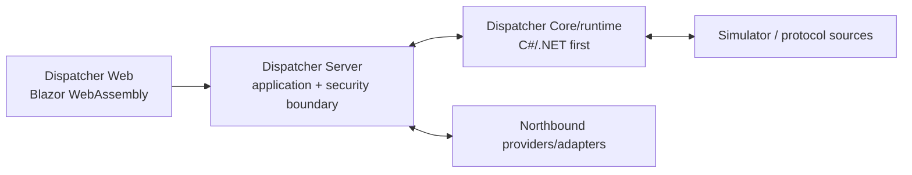

# Dispatcher — мастер-спецификация технической реализации

**Статус:** нормативная implementation-база  
**Дата:** 18 июля 2026 года  
**Целевая аудитория:** AI-архитектор и AI-разработчик  
**Режим:** C#-first; без исходного кода и без изменения продуктового scope

## 1. Назначение

Документ определяет способ реализации уже согласованного Dispatcher. Он не пересказывает продуктовую концепцию и Web UX, а задаёт источники истины, архитектурные ограничения, состав модулей, последовательность стабилизации и общую Definition of Done.

Исполняемая последовательность находится в `./DISPATCHER_IMPLEMENTATION_ROADMAP.md` и `./DISPATCHER_SPRINT_CATALOG.md`.

## 2. Источники и приоритет

| Приоритет | Источник | Нормативная область |
|---|---|---|
| 1 | `../../outputs/product_concept_dispatching_platform.md` | Целевой продуктовый контур и предметные понятия |
| 2 | `../../WEB_INTERFACE_SPECIFICATION.md` | UX, маршруты, состояния Web и пользовательские сценарии |
| 3 | `../../WEB_BACKEND_API_REQUIREMENTS.md` | Логические Q/C/RT/FJ потребности Web и maturity границы |
| 4 | `../../BACKEND_ARCHITECTURE_CONCEPT.md` | System context, authority, bounded contexts, flows и topology alternatives |
| 5 | `../../CORE_ARCHITECTURE_SPECIFICATION.md` | Core/runtime authority и deterministic semantics |
| 6 | `../../SERVER_ARCHITECTURE_SPECIFICATION.md` | Server application/security, projections, realtime и jobs |
| 7 | `./ADR-001_CSHARP_FIRST_RUNTIME.md` | C#-first изменение технологической привязки Core |
| 8 | Настоящий комплект | Порядок и правила реализации |

`../../docs/specification/`, `../../docs/planning/`, `../../outputs/DISPATCHER_SYSTEM_ARCHITECTURE_BASELINE.md` и статический прототип не являются нормативной implementation-базой текущей ветки. Они используются только по явной ссылке для проверки конкретного риска.

При конфликте более поздний implementation-документ не имеет права молча менять продукт или authority. Конфликт фиксируется как blocking decision.

## 3. Зафиксированный контекст

- одна организация, много локаций;
- production deployment и production acceptance — Linux;
- основная development environment — Visual Studio 2026;
- Server — C#/ASP.NET Core;
- Web — C#/Blazor WebAssembly;
- Core/runtime — logical authority boundary, C#/.NET first;
- один repository и единая .NET solution;
- начальная организация — modular monolith без требования одного production process;
- точный process count, transport, storage topology и numeric limits закрываются предшествующими gates;
- отдельные сервисы и native components создаются только по evidence.

## 4. Неподвижные архитектурные правила

1. Web, kiosk и wallboard взаимодействуют только с Server.
2. Server является единственной Web-facing application/security boundary.
3. Server не выполняет protocol I/O и не становится вторым runtime evaluator.
4. Core владеет runtime current, source lifecycle, local Alarm occurrences/evaluation, active runtime set, applied constraints и будущим CommandExecution своего scope.
5. Core не владеет users, Dashboard authoring, Incident, Notification policy, My Work либо Maintenance work.
6. Один mutable state имеет одного authoritative writer; cross-owner direct writes запрещены даже в общей БД.
7. Current, History, Event, Audit, projections и Web delivery используют разные acceptance points и positions.
8. Realtime начинается с authorized snapshot, обнаруживает gap и выполняет resync; realtime не восстанавливает History.
9. Draft, validation, publication, distribution, receipt и activation являются разными состояниями.
10. Event, AlarmOccurrence, Incident, Notification, Task и WorkOrder не объединяются универсальной сущностью.
11. Production physical write capability отсутствует до command/security/protocol/operations gates и отдельного final enablement decision. Изолированная qualification capability допустима только в user-authorized `S39–S40` и не включает production readiness.
12. Fire/life-safety sources по умолчанию read-only; Dispatcher не заменяет certified local protection.

## 5. Логический каркас

Диаграмма не фиксирует process topology. Simulator может быть co-hosted. Production protocol I/O требует отдельного process/security decision.

## 6. Implementation-модули

Модуль — unit ответственности и владения, не обязательный project/process/service.

| ID | Контур | Основная ответственность |
|---|---|---|
| `MOD-PLT` | Platform | Build/test, configuration, persistence substrate, jobs, observability, health |
| `MOD-IAM` | Identity and Access | Sessions, effective permissions, scope, revocation и terminal/user context |
| `MOD-WSP` | Personal Workspace | Web shell, Home, person pages, profile/preferences, search, favorites/recent |
| `MOD-FAC` | Facility Model | Локации, физические/функциональные связи и scope hierarchy |
| `MOD-EQP` | Equipment | Equipment, points, definitions, staging и commissioning state |
| `MOD-RLS` | Configuration/Release | Revisions, validation, publication, distribution и desired release |
| `MOD-RTM` | Runtime/Core | Acquisition, normalization, current, quality/freshness, activation и readiness |
| `MOD-ALM` | Alarm Runtime | Local rules/evaluation и AlarmOccurrence lifecycle |
| `MOD-HIS` | History | Sample/gap acceptance, range query, aggregation и retention |
| `MOD-EVT` | Event Journal | Immutable operational event records и Event Dispatcher query model |
| `MOD-DSH` | Dashboards/Mimics | Dashboard/Window/Widget/Mimic revisions, manifests и scoped runtime |
| `MOD-NOT` | Notifications | Policy, coverage, delivery obligation, personal inbox и provider execution |
| `MOD-INC` | Incidents | Утверждённый incident nucleus и связи с источниками |
| `MOD-WRK` | My Work | Permission-filtered projection source assignments; не owner исходных задач |
| `MOD-MNT` | Maintenance | Independent assets, ППР, requests, defects и work orders |
| `MOD-TRM` | Terminals | Device identity, enrollment, profile, content assignment и presence |
| `MOD-ADM` | Administration | Accounts/roles/scopes UI, settings, integrations, data quality и audit views |
| `MOD-CMD` | Control/Command | Control lease, intent, execution и uncertain outcome только после gate |

Модули создаются по мере начала соответствующего этапа. Пустые future projects, interfaces и service stubs запрещены.

## 7. Стратегия реализации

1. Создать platform foundation и закрыть непосредственные toolchain/data/security decisions.
2. Провести walking skeleton: Simulator → Core/runtime → Server → scoped realtime → один Web widget.
3. Реализовывать контуры последовательно до production-like состояния в текущем dependency envelope.
4. Каждый новый публичный contract проверять реальным consumer до статуса Stable.
5. После каждого контура выполнять system smoke/regression suite; интеграцию не откладывать до конца.
6. Production readiness продукта подтверждать отдельно после всех модулей, Linux operations, security, recovery и load acceptance.

Production-like модуль не означает, что продукт уже готов к production вне завершённых зависимостей.

## 8. Сквозные обязательства

Каждый модуль, где применимо, включает:

- explicit owner, state transitions и invariants;
- persistence, migrations, backup/recovery classification;
- permission checks и metadata-leak protection;
- audit obligation;
- concurrency, idempotency и timeout/unknown semantics;
- bounded inputs, queues, retries и resource use;
- observability, health/readiness и degraded state;
- versioned contract и compatibility rule;
- unit/property/contract/integration/fault/security/load/platform tests;
- минимальный интегрированный пользовательский сценарий;
- Linux build/run evidence.

Эти обязанности не выделяются в декоративные abstractions до появления потребителя.

## 9. Данные и интеграция

- Один initial database technology может обслуживать несколько модулей, но ownership и migrations остаются модульными.
- Cross-owner чтение выполняется через contract/projection; direct foreign writes запрещены.
- Transactional owner transition и обязательная source/audit obligation принимаются атомарно либо fail closed.
- Event, History и Audit не объединяются generic log.
- Rebuildable projection не становится source of truth.
- Transport выбирается для реальной boundary; общий язык не требует преждевременного IPC.
- Message broker, distributed cache и service discovery не добавляются без измеримого сценария.

Конкретные storage/transport решения закрываются gates дорожной карты и ADR, а не подразумеваются этим документом.

## 10. Готовность к возможному C++

Только потенциально переносимый runtime/protocol code должен:

- не зависеть от ASP.NET Core, Blazor и EF Core;
- принимать explicit inputs/clocks/configuration;
- иметь deterministic golden/property suite;
- использовать узкие semantic contracts;
- не владеть общей БД через скрытые shared writes;
- не переносить authority в adapter/worker.

Это требования к разделению ответственности, а не разрешение создавать generic interfaces, C ABI или native project.

## 11. Scope maturity

Подробно реализуются области, для которых `../../WEB_BACKEND_API_REQUIREMENTS.md` допускает детальные contracts. Следующие функции остаются целевым продуктом, но не получают детальный implementation sprint до отдельного product/contract gate:

- полный incident/crisis workspace;
- развитый maps editor;
- schedules/modes/scenarios beyond accepted nucleus;
- reports, documents и shift log;
- mobile technician и contractor portal;
- automatic discovery;
- wallboard playlists;
- полный external IAM/provisioning lifecycle;
- общая адаптивность всех рабочих мест.

Provisional не означает отмену функции. Это запрет выдумывать её contract раньше продуктового решения.

## 12. Definition of Done модуля

Модуль получает статус `Accepted in dependency envelope`, когда:

1. scope/non-goals и owners соблюдены;
2. все planned transitions, queries, jobs и realtime данного этапа реализованы;
3. persistence/recovery, security/audit и observability проверены;
4. публичный contract использован минимум одним реальным consumer;
5. автоматические acceptance tests проходят на обязательных платформах;
6. применимые non-provisional критерии и маршруты `../../WEB_INTERFACE_SPECIFICATION.md` пройдены;
7. regression suite ранее завершённых контуров остаётся green;
8. отсутствуют незаявленные заглушки, обходы authority и production secrets/defaults;
9. документация, ADR и `./IMPLEMENTATION_STATE.md` отражают фактическое состояние.

## 13. Изменения и решения

AI-разработчик самостоятельно принимает локальные решения. ADR обязателен, если меняются:

- product scope или maturity;
- authority/data ownership;
- public cross-module contract;
- process/service topology;
- persistence/transport baseline;
- security model;
- command safety;
- C#-first или extraction posture.

При blocking противоречии затронутая часть останавливается; незатронутая работа может продолжаться.

## 14. Global non-goals

- перепроектирование продуктовой концепции или Web;
- microservice per bounded context;
- implementation всех модулей понемногу;
- big-bang интеграция после изолированных библиотек;
- C++ до evidence;
- physical writes до gate;
- generic repository/event bus/workflow engine для гипотетического reuse;
- фиксирование экспериментальных numeric limits как нормативных;
- детальные API provisional-функций.

## 15. Точка начала

Первый исполняемый пакет — `S01` в `./DISPATCHER_SPRINT_CATALOG.md`. Источником статуса является `./IMPLEMENTATION_STATE.md`.
