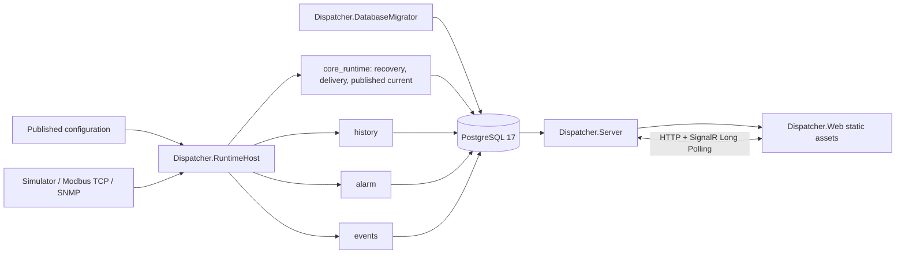
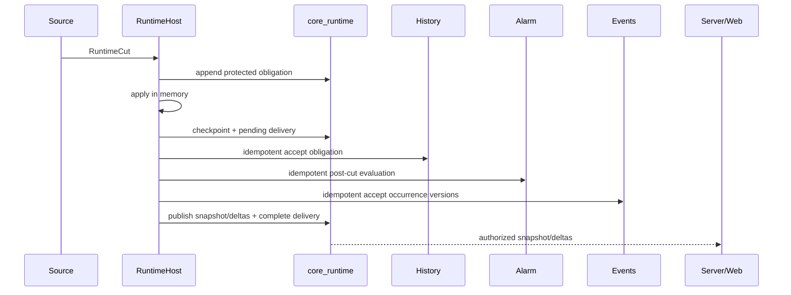

# Dispatcher — корректирующая архитектурная спецификация

**Статус:** целевой baseline корректирующей программы  
**Дата:** 26 июля 2026 года  
**Область:** производственная композиция C#/.NET приложения на Windows 11 и PostgreSQL 17

## 1. Цель

Существующий проект содержит развитые доменные модули, PostgreSQL stores, Server API, Blazor Web, Simulator, Modbus TCP, SNMP и автоматические тесты. Главный незакрытый риск — отсутствие доказанного производственного потока между этими частями.

Спецификация фиксирует минимальную архитектуру, после реализации которой проект можно проверять как целую диспетчерскую систему, а не как набор изолированных модулей.

## 2. Зафиксированные решения

1. Основной runtime остаётся на C#/.NET.
2. `Dispatcher.RuntimeHost` и `Dispatcher.Server` остаются отдельными процессами.
3. Общий межпроцессный контракт строится на PostgreSQL 17.
4. Дополнительный broker и loopback HTTP между RuntimeHost и Server сейчас не вводятся.
5. Миграции выполняет отдельный одноразовый `Dispatcher.DatabaseMigrator`.
6. Web публикуется Server под одним origin.
7. Первый законченный контур строится на Simulator.
8. Modbus TCP ограничен FC03/FC04, SNMP — GET.
9. Физические команды реальным устройствам остаются hard deny.
10. Docker и Linux не входят в текущую реализацию и приёмку.
11. Один экземпляр RuntimeHost на текущем этапе обслуживает один явно заданный `RuntimeScopeId` и ограниченное число источников.
12. C++ рассматривается только после измерений готового C#-контура.

## 3. Топология процессов

### 3.1. DatabaseMigrator

- Единственный production entry point, применяющий module migrations.
- Получает migration connection и явное сопоставление owner → database role.
- Применяет все планы в стабильном порядке.
- Повторный запуск идемпотентен.
- При checksum conflict, отсутствующей роли или недоступной БД завершается ошибкой без запуска остальных процессов.
- Не создаёт и не хранит пароли. Provisioning ролей остаётся deployment-операцией.

### 3.2. RuntimeHost

- Владеет source reconciliation, session generation, scheduling, protocol I/O и обработкой runtime facts.
- Не содержит HTTP API для пользовательского Web.
- Не использует пользовательскую сессию для фоновой работы.
- Выполняет только workload-authorized чтение/подтверждение опубликованной конфигурации.
- Пишет core runtime, history, alarm и event данные через соответствующие owner stores.
- Не накапливает неограниченные очереди при отказе БД или downstream.

### 3.3. Server

- Владеет локальной аутентификацией, пользовательской авторизацией, HTTP API и SignalR.
- Читает только опубликованный current contract, а не объект `CoreRuntime` другого процесса.
- Не выполняет protocol I/O.
- Размещает WebAssembly assets и fallback route.
- Предоставляет liveness/readiness и permission-filtered operational health.

### 3.4. Web

- Работает same-origin с Server.
- Не содержит секретов и не считается границей авторизации.
- Получает runtime scope из авторизованного bootstrap/рабочего контекста, а не из статического `appsettings.json`.
- Использует snapshot → ordered delta → resnapshot on gap.

## 4. Владение PostgreSQL

Сохраняются правила ADR-004:

- отдельная schema и owner role для authoritative owner;
- migration principal может `SET ROLE` только к разрешённым owner roles;
- runtime principals имеют минимальные memberships;
- cross-owner write запрещён;
- cross-owner read выполняется через явный contract.

Для current feed Core предоставляет Server отдельный read-only contract. Server не получает права на `source_obligation`, recovery checkpoint, source sessions или pending delivery.

Минимальные production principals:

- migration principal;
- RuntimeHost principal с необходимыми owner memberships;
- Server principal с server-owned memberships и read-only current role;
- PostgreSQL administrator используется только для provisioning/restore, не для обычного запуска.

## 5. Логическая модель Core runtime

Существующая schema `core_runtime` расширяется новой migration version; уже применённый SQL не переписывается.

Логически необходимы:

### 5.1. Source session generation

Durable счётчик по `(scope, source)`, атомарно выдающий следующую ненулевую `SourceSessionGeneration`. После перезапуска или повторной активации старое поколение не используется повторно.

### 5.2. Protected source obligation

Существующий immutable факт, создаваемый до изменения runtime state. Он остаётся основанием восстановления и downstream delivery.

### 5.3. Processing delivery

Durable запись по obligation position, содержащая достаточную информацию для повтора post-cut обработки:

- identity и тип runtime fact;
- `RuntimeCutAcceptance` либо gap outcome;
- definition/configuration epoch;
- состояние доставки History, Alarm и Event;
- время и безопасный код последней ошибки.

В каждый момент для одного scope обрабатывается не более одной незавершённой delivery. Следующий факт не применяется, пока текущая delivery не завершена.

### 5.4. Published scope

Permission-neutral operational state scope:

- последний завершённый obligation position;
- current cursor;
- continuity/readiness;
- heartbeat и время последней успешной публикации;
- безопасный reason code деградации.

### 5.5. Published current snapshot

Одна актуальная запись на point с типизированным значением, unit, quality, freshness, source/receive/processed timestamps, source и current position.

### 5.6. Retained published deltas

Упорядоченные current transitions, ограниченные на scope явной capacity. Старый cursor создаёт `Gap`; snapshot не удаляется при pruning delta.

Физические названия таблиц могут быть адаптированы к принятому стилю, но их семантика и права являются обязательными.

## 6. Транзакционные границы обработки

Обязательный порядок:

1. Получить bounded poll attempt.
2. Нормализовать результат в `RuntimeCut`.
3. Durably append protected obligation.
4. Последовательно применить obligation к `CoreRuntime`.
5. В одной core-owner transaction сохранить checkpoint и pending delivery.
6. Идемпотентно передать obligation в History.
7. Для cut выполнить Alarm evaluation на его post-cut snapshot.
8. Идемпотентно передать версии occurrences в Events.
9. В одной core-owner transaction опубликовать current transitions, обновить published scope и завершить delivery.
10. Только после этого применять следующий obligation.

Если шаг 6–8 завершился частично, повтор начинается с той же delivery. History, Alarm и Event обязаны распознавать replay. Current не публикуется до полного downstream success.

При рестарте RuntimeHost сначала восстанавливает Core checkpoint и завершает pending delivery. Новые bindings и polling допускаются только после этого.

Существующий process-local `RuntimeObligationCommitHook` не может быть единственным триггером downstream: callback после durable append может быть потерян при crash. Источником повторного выполнения является persisted processing delivery.

Завершённые obligations очищаются ограниченными batches только после durable checkpoint, завершённой delivery и заданного recovery safety window. History является долговременным хранилищем телеметрии; Core journal не должен расти бесконечно.

## 7. Source lifecycle

Состояния источника:

`Absent → Reconciled → Commissioned → Active → Degraded/Offline → Draining → Stopped`

Правила:

- Только целая опубликованная scope revision может стать runtime activation.
- Structural validation выполняется до activation.
- Новая `BindingGeneration` fence-ит старую конфигурацию.
- Новая `SourceSessionGeneration` fence-ит старый процесс/сеанс.
- Завершение старого in-flight poll после fence считается stale и не применяется.
- Неуспешная новая revision не разрушает последнюю рабочую revision.
- Source failure не останавливает другие источники.
- Отсутствие активного manifest делает scope not ready, но не приводит к бесконечному crash-loop.

Для первого Simulator slice допускается чтение уже активированного `SimulatorRuntimeStore` manifest. Задание конфигурационной reconciliation впоследствии заменяет этот bootstrap полноценным workload flow.

## 8. Polling

- Используется существующий `BoundedPollScheduler`.
- Poll interval, timeout, maximum sources, maximum in-flight, ingress capacity и current/delta limits задаются конфигурацией RuntimeHost.
- На первом baseline допускается общий poll interval для источников; per-source cadence требует отдельного versioned configuration contract.
- Перекрывающийся poll одного source не запускается.
- Timeout и capacity miss наблюдаемы, но не создают фиктивных значений.
- Poll result принимается только для точной active binding/session.
- При закрытом ingress новые polls не запускаются.

## 9. History, Alarm и Event

- History принимает каждый cut/gap по runtime fact position.
- Alarm evaluation выполняется после применения cut и использует точный post-cut current state.
- Gap не превращается в нормальное значение; он влияет на continuity/quality.
- Alarm definition epoch соответствует активной configuration revision. Пустой набор определений является допустимым явно активированным набором.
- Condition, acknowledgement, assignment, shelving и suppression остаются независимыми facets.
- Events принимают каждую новую occurrence facet version идемпотентно.
- Пользовательские alarm actions продолжают проходить через Server и после commit проецируются в EventStore.

## 10. Current read contract и realtime

Server reader выполняется асинхронно через PostgreSQL.

Snapshot должен возвращать согласованную пару:

- published scope cursor;
- permission-filtered current points на этом cursor.

Delta:

- принимает private core cursor;
- возвращает все доступные переходы до нового cursor;
- скрытые permission filtering изменения не видны Web, но продвигают private cursor;
- cursor старше retention даёт `runtime.cursor_gap`;
- cursor впереди published state отклоняется;
- no-change не вызывает render.

SignalR сохраняет отдельные private core cursor и opaque Web cursor на connection, как требует ADR-006.

## 11. Web session и transport

- Сессионный token передаётся в `Authorization: Dispatcher-Session ...`.
- Token запрещено передавать через query string.
- Для runtime hub начальный браузерный transport — SignalR Long Polling, позволяющий отправить header.
- После refresh/replacement сессии соединение создаётся заново и выполняет bootstrap.
- Revocation, expiry, permission change или visible-set change очищает клиентское runtime state.
- Runtime scope выбирается из permission-filtered server bootstrap.
- Production не использует `TestSessionBridge`.

## 12. Same-origin Web

Server:

- публикует Blazor framework/static files;
- maps API и hubs до fallback;
- возвращает `index.html` для клиентских routes;
- не включает permissive CORS как замену same-origin;
- не кэширует `index.html` и session-sensitive ответы как immutable assets.

Web реализует только проработанные Core-capabilities. Provisional areas из `WEB_BACKEND_API_REQUIREMENTS.md` не получают выдуманные contracts.

## 13. Configuration deployment и diagnostics

RuntimeHost не вызывает user-authorized `ConfigurationService` с фиктивной пользовательской сессией.

Configuration owner предоставляет отдельный workload contract:

- получить/claim точную опубликованную и distributed revision;
- получить manifest и fingerprints;
- зафиксировать validation/activation outcome;
- повторить после crash без двойной activation.

Diagnostics выполняются RuntimeHost:

1. Server авторизует пользователя и создаёт durable diagnostic job.
2. RuntimeHost claims job через PostgreSQL contract.
3. RuntimeHost выполняет connection test/sample poll с timeout и secret resolver.
4. Сохраняется только sanitised result, связанный с configuration fingerprint.
5. Изменение draft делает старый результат stale.

Server и Web не получают plaintext secret и не выполняют сетевой protocol I/O.

## 14. Modbus TCP и SNMP

### Modbus TCP

- Только holding/input registers: FC03/FC04.
- Явные unit ID, address, type, byte order, word order и scale.
- Ограничение количества points/registers, timeout, retries и concurrency.
- FC05/06/15/16 и другие write operations отсутствуют в production registration.

### SNMP

- На текущем этапе SNMP v2c GET.
- Community доступна только по secret reference внутри RuntimeHost.
- Ограничены response bytes, OID count, timeout, attempts и concurrency.
- SET и неограниченный walk отсутствуют.

Реальная лабораторная проверка использует внешнюю конфигурацию и не сохраняет адреса/секреты в репозитории.

## 15. Simulator command boundary

Существующий command lifecycle разрешается только для Simulator:

- target и adapter имеют явный simulator kind;
- production Modbus/SNMP adapters не регистрируются как command executors;
- Web показывает физическое управление выключенным;
- kiosk wallboard всегда deny;
- никакое имя настройки не может незаметно включить physical write.

## 16. Failure policy

| Сбой | Обязательное поведение |
|---|---|
| PostgreSQL недоступен при старте | Процесс жив, но not ready; polling не начинается; bounded retry |
| PostgreSQL потерян во время работы | Закрыть admission, не накапливать память, завершить/fence in-flight и восстановиться новой session |
| Один source недоступен | Только source degraded/offline; остальные продолжают работу |
| Poll timeout | Attempt завершён timeout, следующий запуск по scheduler policy |
| Ingress full | Зафиксировать gap, если БД доступна; закрыть admission до recovery |
| Downstream History/Alarm/Event недоступен | Pending delivery сохраняется; current не публикуется; bounded retry |
| Server недоступен | Runtime продолжает bounded processing; delta retention ограничена |
| Web медленный/перезапущен | Gap/resnapshot; Server не хранит бесконечный backlog |
| Новая configuration invalid | Сохранить старую active generation, опубликовать sanitised rejection |
| Secret unavailable | Source not ready/degraded; secret не раскрывается |

Retry использует ограниченную exponential backoff с cancellation и без tight loop. Конкретные интервалы являются deployment settings и проверяются тестами.

## 17. Readiness и observability

Различаются:

- process liveness;
- database/schema readiness;
- runtime recovery complete;
- active configuration/source readiness;
- downstream delivery lag;
- source quality/connectivity;
- overall operational health.

RuntimeHost обновляет bounded heartbeat/readiness в published scope. Server предоставляет:

- unauthenticated minimal liveness/readiness endpoints без чувствительных деталей;
- authorized подробный operational health;
- correlation IDs, structured logs, metrics и traces без секретов.

## 18. Windows operations

Production sequence:

1. provision database, roles и защищённые secrets;
2. запустить DatabaseMigrator и получить success;
3. запустить RuntimeHost;
4. запустить Server, который публикует Web;
5. проверить health/readiness и Simulator;
6. только затем активировать реальные read-only sources.

RuntimeHost и Server должны поддерживать graceful stop и запуск как Windows services. DatabaseMigrator остаётся one-shot.

Backup включает authoritative schemas и необходимые защищённые настройки. Restore проверяется в отдельную БД до объявления готовности.

## 19. Acceptance boundary

Production-ready утверждается только после:

- fresh/repeat migration;
- Simulator process E2E;
- crash/restart и PostgreSQL outage corpus;
- browser E2E основных ролей;
- Modbus/SNMP read-only laboratory evidence;
- Windows service restart;
- backup/restore;
- bounded load/soak.

Linux и Docker не входят в эту boundary.

## 20. C++ gate

До C++ допускается только измерительный отчёт:

- воспроизводимый workload;
- CPU, allocations, memory, latency percentiles и throughput;
- конкретный component boundary;
- сравнительный prototype/benchmark;
- стоимость interop, deployment и диагностики.

Без доказанного узкого места решение остаётся C#.
